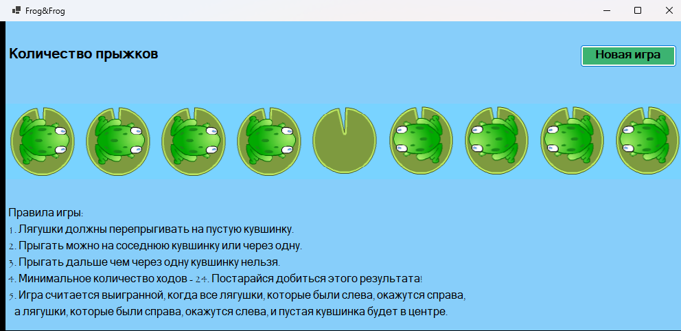
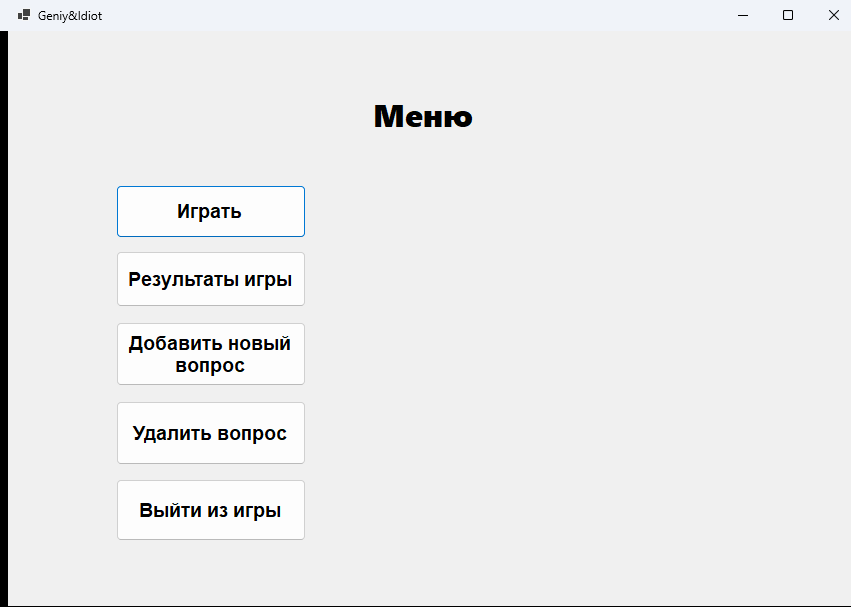
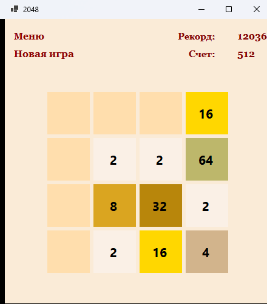
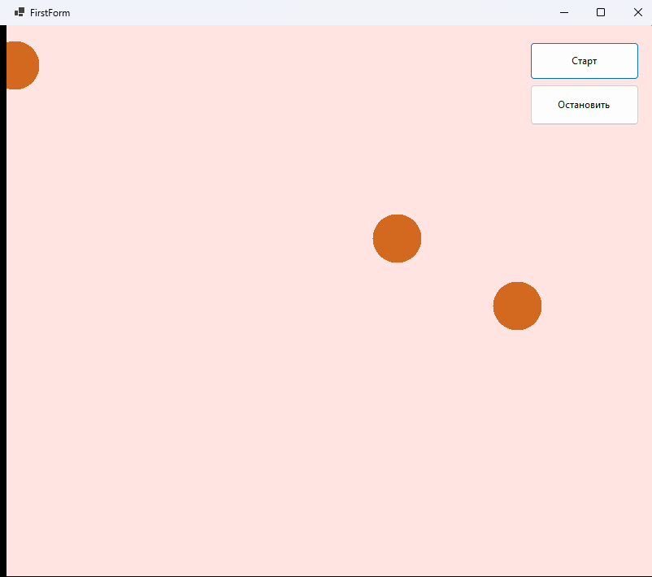

# Игры на WinForms

Четыре настольных приложения на C# и Windows Forms, написанные в ходе курса по
объектно-ориентированному программированию. Каждое — отдельное решение Visual Studio,
собирается и запускается независимо.

**Стек:** C#, .NET 9, Windows Forms, GDI+ для отрисовки.

## Лягушки

Логическая головоломка. Четыре лягушки слева и четыре справа должны поменяться местами,
перепрыгивая на соседнюю кувшинку или через одну. Задача решается ровно за 24 хода,
игра считает прыжки и подсказывает, когда ход невозможен.

Вся отрисовка — вручную через GDI+: кувшинки и лягушки рисуются примитивами в обработчике
`Paint`, попадание клика вычисляется по координатам.



## Гений-идиот

Викторина с вопросами на сообразительность. По числу верных ответов выдаётся «диагноз» —
от идиота до гения. Вопросы можно добавлять и удалять прямо из приложения, результаты
игроков сохраняются между запусками.

Решение разделено на три проекта, и это его главная особенность:

- `GeniyIdiot.Common` — библиотека с моделями (`Question`, `User`) и хранилищами
- `GeniyIdiotConsoleApp` — консольная версия
- `WinFormsApp` — оконная версия

Обе версии используют одну и ту же библиотеку: логика игры написана один раз
и не зависит от того, как с пользователем разговаривают.



## 2048

Классическая головоломка: плитки съезжают в сторону нажатой стрелки, одинаковые
складываются. Доступны три размера поля — 4×4, 6×6 и 9×9. Игра запоминает имя игрока,
ведёт счёт и рекорд, хранит историю партий между запусками.

На скриншоте — партия на поле 4×4.



## Шарики

Набор экспериментов с анимацией, построенный вокруг общей иерархии классов —
самая «объектно-ориентированная» часть курса. В библиотеке `BallCommon` лежит базовый
шарик, от которого наследуются остальные:

```
Ball
├── PointBall
└── RandomPointBall
    ├── RandomMoveBall
    │   ├── BilliyardBall
    │   └── FireWorkBall
    │       └── FlyingBall
    └── RandomSizePointBall
```

На этой иерархии построено несколько приложений в одном решении: бильярд с отскоками
от бортов, салют, диффузия, ловля шарика, Fruit Ninja и Angry Birds. Новое поведение
добавляется переопределением методов базового класса, а не копированием кода.



## Как запустить

Нужен [.NET SDK 9.0](https://dotnet.microsoft.com/download) и Windows — приложения
используют Windows Forms.

Каждая игра запускается отдельно:

```bash
dotnet run --project FrogWinFormsApp/FrogWinFormsApp
dotnet run --project GeniyIdiot/WinFormsApp
dotnet run --project 2048WinFormsApp/2048WinFormsApp
dotnet run --project BallGamesWinFormsApp/BallGamesWinFormsApp
```

Либо открыть нужный `.sln` в Visual Studio и нажать F5.

## Структура

```
FrogWinFormsApp/          головоломка с лягушками
GeniyIdiot/               викторина: библиотека + консоль + окна
2048WinFormsApp/          головоломка 2048
BallGamesWinFormsApp/     шарики: общая библиотека и шесть приложений на ней
docs/screenshots/         изображения для этого файла
```

На скриншотах у «Лягушек», 2048 и «Шариков» — игровой процесс, у «Гения-идиота» — стартовое меню.
